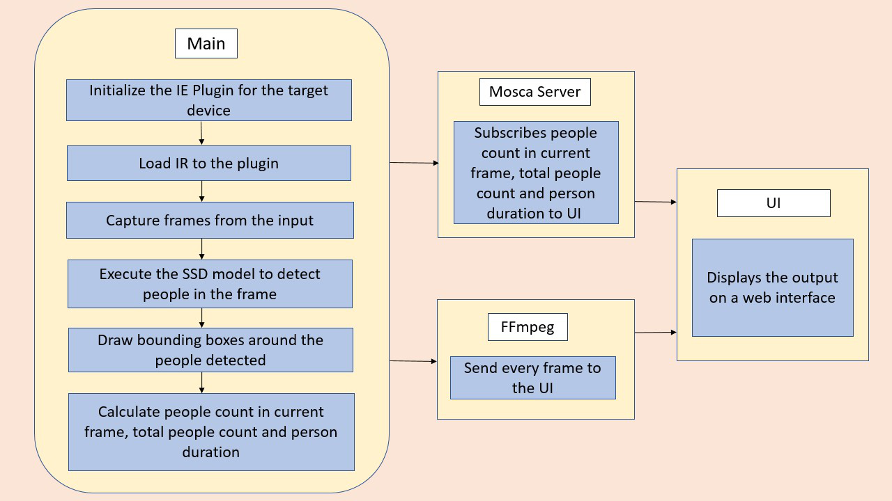

# People_counter_app_with_openvino_toolkit

The people counter application at the edge utilizes Intel® hardware and software tools for converting pre-trained models and running inference on the edge. Thus making overall process convenient and faster. The people counter app was use to detect in realtime the people in a video or camera source and the result which includes total number and average duration of people in a frame was sent across to a local web server using the Paho MQTT Python package.

### Process involved

* Downloading and Conversion of a suitable model capable of detecting persons in a frame
* Preprocessing the frames to the required format before Inference was perfomed
* Sending result locally through FFserver and MQTT server



### Explaining Custom Layers in OpenVINO™

Custom layers are layers that are not in the list of known layers. The Model Optimizer first extracts information from the input model which includes the topology of the model layers along with parameters for each layer. The model is then optimized from the various known characteristics of the layers. Finally, it produces an output to the model IR files needed by the Inference Engine to run the model.

Both ssd_mobilenet_v1_coco and faster_rcnn_inception_v2_coco was tested on this project but faster_rcnn_inception_v2_coco performed better and was more accurate on the particular video given when compared to ssd_mobilenet_v1_coco

### Compare Model Performance

Before comparison let's look at how the model was downloaded and converted for both ssd_mobilenet and faster_rcnn

```
wget http://download.tensorflow.org/models/object_detection/faster_rcnn_inception_v2_coco_2018_01_28.tar.gz
```
```
wget http://download.tensorflow.org/models/object_detection/ssd_mobilenet_v1_coco_2018_01_28.tar.gz
```

The model was extracted using the following commands

```
tar -xvf faster_rcnn_inception_v2_coco_2018_01_28.tar.gz
```
```
tar -xvf ssd_mobilenet_v1_coco_2018_01_28.tar.gz
```

Navigate to the respective files for the model before conversion

```
python /opt/intel/openvino/deployment_tools/model_optimizer/mo.py --input_model faster_rcnn_inception_v2_coco_2018_01_28/frozen_inference_graph.pb --tensorflow_object_detection_api_pipeline_config pipeline.config --reverse_input_channels --tensorflow_use_custom_operations_config /opt/intel/openvino/deployment_tools/model_optimizer/extensions/front/tf/faster_rcnn_support.json
```
```
python /opt/intel/openvino/deployment_tools/model_optimizer/mo.py --input_model ssd_mobilenet_v1_coco_2018_01_28/frozen_inference_graph.pb --tensorflow_object_detection_api_pipeline_config pipeline.config --reverse_input_channels --tensorflow_use_custom_operations_config /opt/intel/openvino/deployment_tools/model_optimizer/extensions/front/tf/ssd_v2_support.json
```

Comparing the performance of a model with and without the use of the OpenVINO™ Toolkit (accuracy, size, speed, CPU overhead)

| Model                                             | Speed(millisecond)  |
| ------------------------------------------------- |--------------------:|
| ssd_mobilenet_v1_coco(without openvino)           | $1600               |
| ssd_mobilenet_v1_coco(with openvino)              | $12            |
| faster_rcnn_inception_v2_coco(without openvino)   | $1     |
| faster_rcnn_inception_v2_coco(with openvino)      | $1     |
